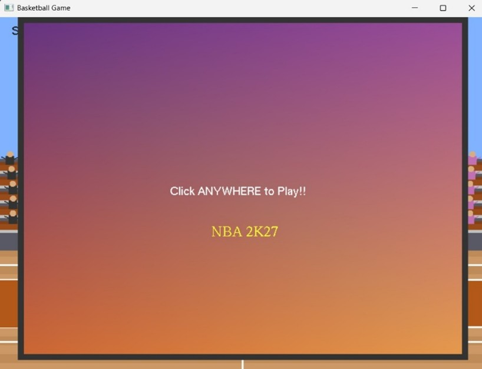
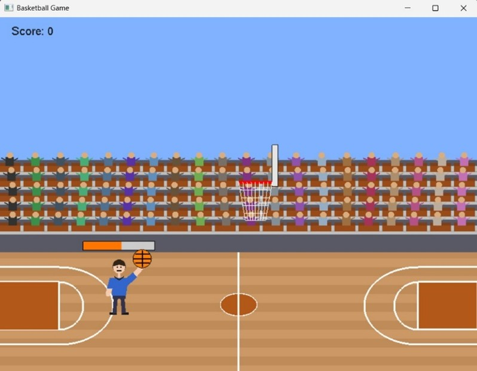
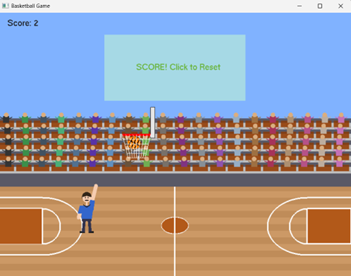
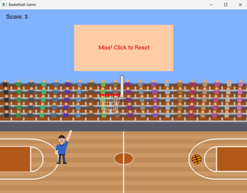
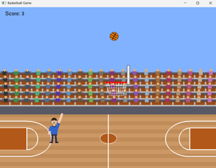
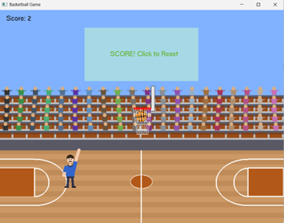

# Ballistic Basketball

A simple 2D basketball shooting game built with C++ and OpenGL (GLUT). Control a stick figure to aim and shoot basketballs into a moving hoop. Score points for each successful shot!

## Features

- Mouse-based aiming and power control
- Realistic ball physics (gravity, friction, bouncing)
- Animated crowd and court environment
- Randomized basket position and size for each round
- Score tracking and feedback for made/missed shots

## Controls

- **Mouse Move:** Aim the shot
- **Mouse Press & Drag:** Set shot power (drag further for more power)
- **Mouse Release:** Shoot the ball
- **Click (after shot):** Reset for next shot
- **R key:** Reset score

## How to Build & Run

1. **Dependencies:**  
   - OpenGL (GLUT/freeglut)
   - C++ compiler (e.g., g++, clang++)

2. **Build Command (example for g++):**
   ```sh
   g++ game.cpp -o basketball -lGL -lGLU -lglut
   ```

3. **Run:**
   ```sh
   ./basketball
   ```

## File Structure

- [`game.cpp`](game.cpp): Main source file containing all game logic and rendering.

## Screenshots







## License

This project is for educational purposes.

---

Enjoy shooting some